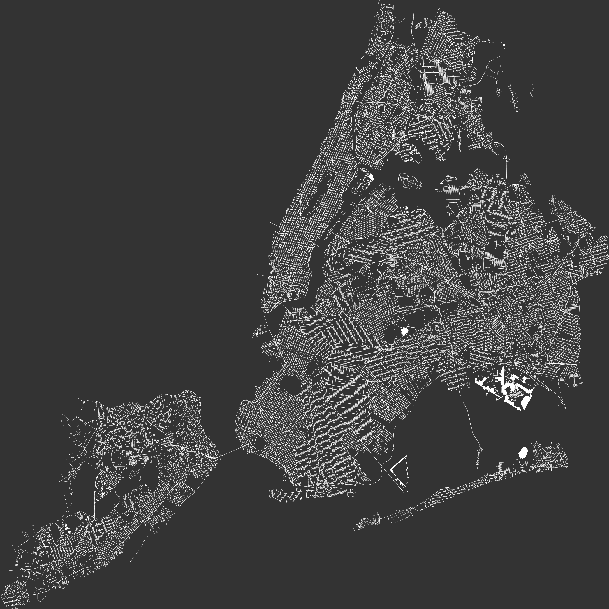

# GMLTool

Trimming Large CityGML files and exporting to Wavefront OBJ files

## Feature

- Load CityGML files
- Extract City Object within a specific positional range.
- Output the final CityGML
- Export CityGML to Wavefront OBJ files with optional mesh merging.
- Large file supported. Streaming process in order to overcome the memory bottleneck.
- Multi-thread supporting

## Usage

### General

```
Description:
  GML tool

Usage:
  GMLTool <input> [command] [options]

Arguments:
  <input>  Input GML file

Options:
  --version       Show version information
  -?, -h, --help  Show help and usage information


Commands:
  --probe                                                           Probe the metadata of the GML file, no output
  --plot <width> <height> <x-min> <x-max> <y-min> <y-max> <output>  Plot a 2D image of the city
  --export                                                          Export from CityGML
```

### Probe

```
Description:
  Probe the metadata of the GML file, no output

Usage:
  GMLTool <input> --probe [options]

Arguments:
  <input>  Input GML file

Options:
  --threads <threads>  Maximum number of threads for processing [default: 32767]
  -?, -h, --help       Show help and usage information
```

### Plot

```
Description:
  Plot a 2D image of the city

Usage:
  GMLTool <input> --plot <width> <height> [<x-min> [<x-max> [<y-min> [<y-max> <output>]]]] [options]

Arguments:
  <input>   Input GML file
  <width>   Width of the plot in pixel
  <height>  Height of the plot in pixel
  <x-min>   Range: X Min
  <x-max>   Range: X Max
  <y-min>   Range: Y Min
  <y-max>   Range: y Max
  <output>  Output plotting image file

Options:
  --max-obj <max-obj>              Maximum number of City Objects to extract (-1 = unlimited) [default: -1]
  --num-obj-total <num-obj-total>  Number of City Objects in the GML input file (-1 = unknown, no progress will be
                                   shown) [default: -1]
  --threads <threads>              Maximum number of threads for processing [default: 32767]
  -?, -h, --help                   Show help and usage information
```

### Plot

```
Description:
  Export from CityGML

Usage:
  GMLTool <input> --export [command] [options]

Arguments:
  <input>  Input GML file

Options:
  --out-gml <out-gml>              Output GML file []
  --merge-mesh                     Merge City Objects to a single mesh in the OBJ file [default: False]
  --out-obj <out-obj>              Output OBJ file []
  --max-obj <max-obj>              Maximum number of City Objects to extract (-1 = unlimited) [default: -1]
  --num-obj-total <num-obj-total>  Number of City Objects in the GML input file (-1 = unknown, no progress will be
                                   shown) [default: -1]
  --threads <threads>              Maximum number of threads for processing [default: 32767]
  -?, -h, --help                   Show help and usage information


Commands:
  --region <x-min> <x-max> <y-min> <y-max>  Extract City Objects from a sub-region
```

### Plot a sub-region

## Run Examples

1. Download and place CityGML data into `Data/`. See [Data/README.md](Data/README.md) for more detail. 
2. Review launch settings and command-line parameters in `GMLTool/GMLTool/Properties/launchSettings.json`.
3. Open the solution with Visual Studio, then run the launch setting `Example: NYC Buildings` and `Example: NYC Roads`.
4. Check output files in `Data/`.
<!-- 

 -->

|  |  |
|---|---|
| Plotting of Buildings | Plotting of Roads |

|  |  |
|---|---|
| Rendered Image 1 | Rendered Image 2 |
